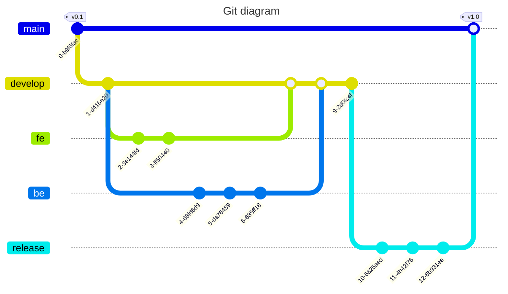

> 参考来自[知乎@笑虎](https://zhuanlan.zhihu.com/p/23478654)的文章。
{: .prompt-info }

## 一般开发流程

- `main` 分支被部署到生产环境
- `develop` 分支用于分离生产与开发、定义前后端接口。不要在 `develop` 上直接进行开发，请参考下一条
- `fe` 和 `be` 分支从 `develop` 捡出，分别负责前端/后端开发
- `release` 分支用于部署前的测试和简单的 debug

## main 分支出现 bug

> hotfix 分支，即热补丁分支。 该分支由 main 分支检出，进行线上版本的 bug 修复，修复完成后 merge 回 main 分支，并 merge 到 develop 分支上，merge 完成后可以将其删除，属于临时性分支。

## release 分支测试出复杂 bug

> 如果 bug 修复比较复杂，可 merge 回 develop 分支后由其他分支进行 bug 修复。

