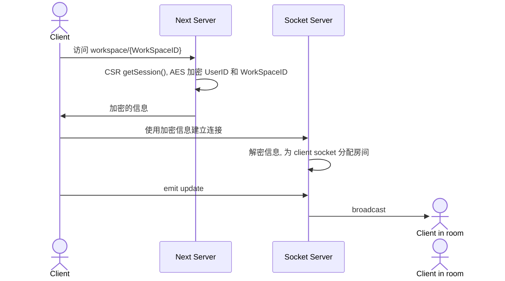
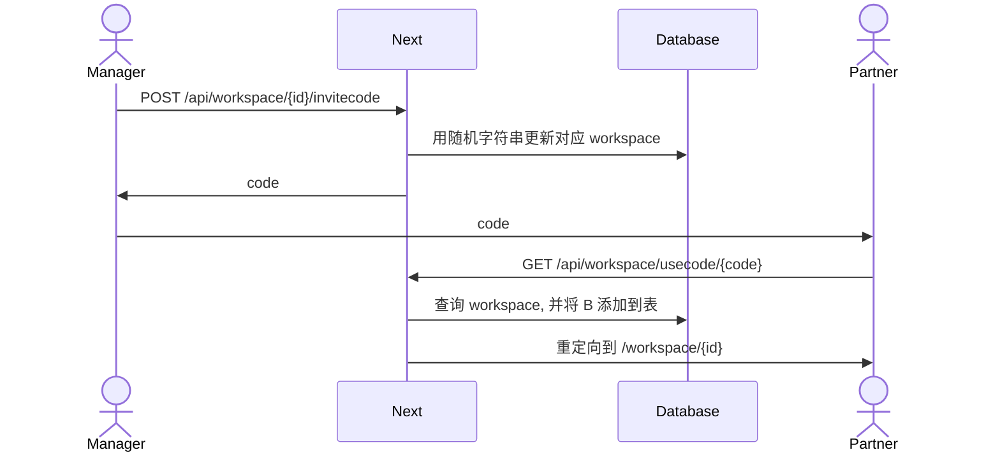

欢迎查看 [源码](https://github.com/Yiipu/Checkdown) 以及 [网站](https://checkdown.azurewebsites.net/).

如果不想注册, 可以使用下面的示例账户.

```
user@example.com
```
```
Abc123456
```

## 数据获取

### 数据先到哪里?

> Whenever possible, we recommend fetching data on the server with Server Components. 

`Next.js` 如是建议. 那么, 具体怎么实现, 采取什么方式实现, 哪些数据不适合服务端获取呢?

#### 服务端

正如 `Next.js` 的建议, 几乎所有的数据获取都应该在服务端进行.

- 支持 `fetch` 的数据源: 在服务端使用 `Next.js` 扩展的 `fetch()`. 这种方式提供了缓存和重新验证.
- 不支持 `fetch` 的数据源: 在服务端使用第三方库. 这种情况下, 虽然数据层面的缓存可能不能保证(取决于第三方库), 但是仍然可以在静态路由段上得到路由层面的缓存的重新验证(对于动态路由段, 参考 [generateStaticParams](https://nextjs.org/docs/app/api-reference/functions/generate-static-params)). 官方文档建议使用 `React` 的 `cache()` 提供更细致的缓存(函数层面的), 不过这个功能在本文编辑时还处于 Canary 阶段.

#### 客户端

对于触发获取需要用户交互的数据 (如下拉加载), 只能在客户端获取. 不过, 这并不意味着放弃缓存或是对数据源的控制, 你仍然可以通过 `server action` 或者 `route handler`  来 "代理" 客户端的请求.

- `server action`: 这是 [`Next.js 14`](https://nextjs.org/blog/next-14#server-actions-stable) 的新功能, 我的理解是将增强的 `POST` 包装成可以在客户端 (和服务端) 调用的函数. 具体的功能和限制参考 [`Server Actions`](https://nextjs.org/docs/app/building-your-application/data-fetching/server-actions-and-mutations#behavior). 对于不需要暴露 API 的应用, 这种方法不仅方便而且提供了渐进式增强以及类型安全.
- `route handler` : 定义 API 路由. 适用于按照传统的后端开发模式, 开发一整套 API 的情况.

#### 一种特殊情形

我的应用是一个 markdown 预览器，因为我希望在服务端将 markdown 转化为 jsx，因此文件的获取必须在服务端且数据首先到达服务端. 

### 数据库管理

数据库最好用单独的模块来管理, 我的应用中, 数据库封装在文件 `pool.js` 中, 并暴露对象 `pool` 和 方法 `handleTransaction(fn)` .

`pool` 是 `mysql2` 提供的 mySQL 的连接池, 当某个函数只需要进行不超过 2 次数据库查询时, 就使用 `pool` 的 `execute(sql,param)` 方法.

`handleTransaction(fn)` 是事务操作的抽象逻辑, 包含了错误处理和回滚, 其接收一个函数作为参数, 这个函数的参数是一个数据库连接 `connection` .

```js
/**
 * Handles a database transaction.
 * @param {Function} fn - A function that accepts a connection as its only argument
 * @throws {Error} Throws an error if getting a connection fails or if the
 *                 transaction fails (either during the execution of `fn` or
 *                 during commit).
 */
async function handleTransaction(fn) {
  const connection = await pool.getConnection()
    .catch((err) => {
      console.error(err);
      throw new Error("Failed to get connetion");
    });
  try {
    await connection.beginTransaction();
    await fn(connection);
    await connection.commit();
  } catch (error) {
    await connection.rollback();
    console.error(error);
    throw new Error("Transaction failed");
  } finally {
    connection.release();
  }
}
```

## 双向数据流

在 服务器-客户端 之间双向传递数据, 可以使用 Socket 编程的方法. 在这个过程中, 我主要做了以下工作:

### 鉴权

#### 权限给予

> 背景知识: Socket 在服务端为用户分配房间. 用户对房间是完全无感的.

客户端建立连接的时候, 发送自己的 session cookie 不就行了吗🤔? 确实, 这样做使鉴权工作可以被"垄断", 更加的安全和优雅. 但是, Socket 服务端拿到这个 cookie 以后, 还需要想办法找 Next 服务端去验证, 并最终拿到用户的信息, 这可能涉及到一些复杂的问题.

为了避免两个服务端之间的交流 (你将很快看到这样做的后果🤡), 我使用了以下方法实现 [#5 为 socket 添加鉴权](https://github.com/Yiipu/Checkdown/issues/5):



#### 权限终止

如果用户退出工作区, 权限被终止, Socket 服务端是不知道的, 于是有了 [#6 用户退出 workspace 后残留 socket 连接的权限](https://github.com/Yiipu/Checkdown/issues/6)! (这个时候我才发现还是在 Socket 和 Next 服务端之间实现沟通更好一些. 或许可以维护一个属于 Next 的连接🤗)

最终我使用数据库触发器来约束进度表的修改. 万事大吉🎉! 不过, 这也让我意识到前期的顶层设计是多么重要, 尤其是安全性问题.

### 组件树

在**服务端**组件中, 将加密的信息传递给 Socket 上下文.

```jsx
<SocketProvider userID={encryptedUserID} workSpaceID={encryptedWorkSpaceID}>
	<MDXRemote source={data.file} components={customMDX()} />
</SocketProvider>
```

```jsx
"use client"
import { useEffect, createContext, useState, useContext, useRef } from 'react';
import { io } from "socket.io-client";

const SocketContext = createContext();

export function SocketProvider({ children, userID, workSpaceID }) {
    // 一些 useState...
    const socketRef = useRef();
  
    useEffect(() => {
        socketRef.current = io({
            auth: (cb) => {
		        // 使用密文 
                cb({ workSpaceID: workSpaceID, userID: userID });
            },
        });
        
        const socket = socketRef.current;
        if (socket.connected) {
            onConnect();
        }

		// 定义一些函数, 并
        // 注册监听...

        return () => {
            // 关闭连接...
        };
    }, [userID, workSpaceID]);

    return (
        <SocketContext.Provider value={[socketRef.current, isConnected, transport, progress]}>
            {children}
        </SocketContext.Provider>
    );

}

export const useSocket = () => useContext(SocketContext);
```

`<SocketProvider>` 在客户端提供了 Socket 连接以及清单进度上下文. UI 组件在进度被更新时就会同步状态, 并且能通过 Socket 连接广播进度更新.

> 如果你有更好的思路, 欢迎在评论区留言! 🙌

## 一些场景

### 邀请码机制

涉及到随机字符串和数据库, 详细信息请查看 [#2 邀请机制](https://github.com/Yiipu/Checkdown/issues/2)



### 事件队列

为了实现 [#12 [功能] 清单description生成](https://github.com/Yiipu/Checkdown/issues/12), 我使用了外部的 NLP API, 这个 API 的工作方式是:

1. POST 若干任务
2. 在 RES 的头部拿到任务的 `位置` (URL)
3. GET `位置`
4. 在 RES 的内容中拿到任务的详细信息(包含状态信息, 结果等)

于是, 为了避免阻塞, 就需要一个事件队列来管理任务了. 我在这个 [commit](https://github.com/Yiipu/Checkdown/commit/d97980c57b6f65ac0af5c75396736a638742e94e) 中使用 `EventEmitter` 实现了一个简单的 `发布者-订阅者` 模型.

## 踩坑

### \<Link\>  preload 导致用户意外登出

[prefetch](https://nextjs.org/docs/app/api-reference/components/link#prefetch) 是 \<Link\> 组件的默认行为. 注意在不想预加载的标签 (如 `/api/auth/logout` 🙂) 手动关闭预加载 (或者改用 a 标签):
```jsx
<Link href="/dashboard" prefetch={false}> 
    Dashboard 
</Link>
```

### next dev 的 hot reloading 导致连接池累积

使用 mysql2 库提供的连接池, 理论上可以重用连接并在高并发时通过排队避免连接过多.

```js
// lib/pool.js
import mysql from "mysql2/promise";
import dotenv from "dotenv";

dotenv.config({ path: ".env.local" });

const createPool = () => {
  try {
    const pool = mysql.createPool({
      host: process.env.DB_HOST,
      port: parseInt(process.env.DB_PORT, 10),
      user: process.env.DB_USER,
      password: process.env.DB_PASSWORD,
      database: process.env.DB_DATABASE,
      connectionLimit: 10,
      waitForConnections: true,
      queueLimit: 10,
    });
    return pool;
  } catch (error) {
    console.log(`Could not connect - ${error}`);
    return null;
  }
};

const pool = createPool();
export { pool };
```

```js
import { pool } from 'lib/pool'
await pool.execute(query,[...params]);
```

然而在调试时, 数据库因为连接过多报错了. 包作者的 GitHub 仓库也有人提类似的 issue, 有人提到可能是热重载的问题.  
热重载的过程中, 有多个连接池实例被创建, 而旧的连接池没有释放其连接, 新的实例又建立了新的连接, 这就导致了问题发生.